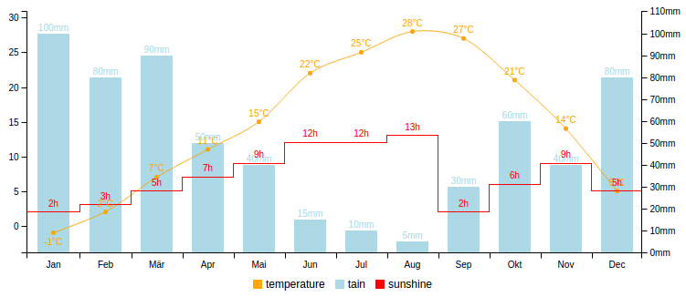

# angular-chart [](https://travis-ci.org/maxklenk/angular-chart) [](https://coveralls.io/r/maxklenk/angular-chart?branch=master) [](https://gemnasium.com/maxklenk/angular-chart)

> adjustable dynamically updating stateful charts for [AngularJS](https://github.com/angular/angular.js)



angular-chart is a [AngularJS](https://github.com/angular/angular.js) directive, which is build on top of [C3.js](https://github.com/masayuki0812/c3) a [d3](https://github.com/mbostock/d3)-based chart library.


## Install

You can download all necessary angular-chart files manually or install them with [Bower](http://bower.io/):
```sh
bower install angular-chart --save
```

Add everything to your index.html:
```html
<link rel="stylesheet" href="bower_components/c3/c3.css" />
<link rel="stylesheet" href="bower_components/angular-chart/css/angular-chart.css">

<script src="bower_components/angular/angular.js"></script>
<script src="bower_components/d3/d3.js"></script>
<script src="bower_components/c3/c3.js"></script>
<script src="bower_components/angular-chart/angular-chart.js"></script>
```

Specify the directive in your module dependencies:
```javascript
angular.module('myApp', ['angularChart'])
```


## Usage

Add the corresponding data in your controller:
```javascript
$scope.options = {
  data: [
    {
      sales: 130,
      income: 250
    }
  ],
  dimensions: {
    sales: {},
    income: {}
  }
};
```

Then you are ready to use the directive in your view:
```html
<div ng-controller="Controller">
  <angular-chart options="options"></angularchart>
</div>
```


## API

The options object can contain four different keys:
* `data` JSON based data you want to visualize
* `dimensions` Specifies which and how the data dimensions will be plotted
* `chart` Access to the full API of [C3.js](http://c3js.org/examples.html) to style your visualization
* `state` Current state of interactions with the chart


### data
A JSON data array which can contain numbers and string.
```javascript
$scope.options = {
  data: [
    {
      sales: 130,
      weekday: 'Monday',
      date: '2015-04-04 12:13:55'
    }
  ]
};
```


### dimensions
Specifies which and how the data dimensions will be plotted.

#### dimension.type : String
Possible values: `line, spline, bar, scatter, area, area-spline, step, area-step, step`

---
#### dimension.axis : String
Possible values: `x, y, y2`
Defines the axis the row is linked.

---
#### dimension.name : String
Optional name for the row.

---
#### dimension.show : String
Defines if the row should be rendered in the chart.

---
#### dimension.color : String
Defines the color for this row.

---
#### dimension.label : boolean
Defines if labels are shown or not (default: `false`)

---
#### dimension.dataType : String
Possible values: `numeric, indexed, category`

---
#### dimension.dataFormat : String | Function
The dataFormat is used convert timestamps in in Date objects, it uses the [D3 Time Formatting](https://github.com/mbostock/d3/wiki/Time-Formatting).
Sample:`%Y-%m-%dT%H:%M:%S`

---
#### dimension.displayFormat : String | Function
If the xAxis displays a timestamp the format of if can be defined by passing a String which follows the [Time Formatting of D3](https://github.com/mbostock/d3/wiki/Time-Formatting). Alternatively a custom function can be passed.
Sample: `function (x) { return x.getFullYear(); }`


### Chart 
Access to the full API of [C3.js](http://c3js.org/examples.html) to style your visualization.


### State
Current state of interactions with the chart.

##### state.range : Array ```[a, b]```
The current zoomed in range can get and set here. Works also for the subchart.

---
##### state.selected : Array
Contains an array with all selected points of the chart:

Multichart (line, spline, bar, scatter):
```
{
  value: VALUE,
  id: COLUMN_NAME,
  index: X_AXIS_INDEX
}
```

Pie-, Donut chart: _(Currently adding a selection in the Array will not add the selection in the chart)_
```
{
  id: COLUMN_NAME,
  values: [ALL_COLUMN_VALUES]
}
```


## Changelog 0.2.X to 0.3.0

* `<angular-chart></angular-chart>`(preferred) and `<angularchart></angularchart>` can be used
* orientation, watchLimit


## Development [](https://waffle.io/maxklenk/angular-chart) [](https://gitter.im/maxklenk/angular-chart)


We use Karma and jshint to ensure the quality of the code. The easiest way to run these checks is to use grunt:
```sh
npm install -g bower gulp
npm install
gulp
```


## Contributing

Please submit all pull requests the against develop branch. Make sure it passes the CI [](https://travis-ci.org/maxklenk/angular-chart) and add tests to cover your code [](https://coveralls.io/r/maxklenk/angular-chart?branch=develop). Thanks!


## Authors

**Max Klenk**

+ http://github.com/maxklenk


## Credit

angular-chart was first developed as the technical part of my bachelor thesis "Real-time collaborative Visual Analytics with AngularJS and D3.js".
The thesis was written at the [Professorship of Media Computer Science](http://www.fim.uni-passau.de/en/media-computer-science/) ([Prof. Dr. Michael Granitzer](https://github.com/mgrani)) of the [University of Passau](http://www.uni-passau.de/en/) and in cooperation with @ONE-LOGIC.


## Copyright and license

	The MIT License

	Copyright (c) 2014 Max Klenk

	Permission is hereby granted, free of charge, to any person obtaining a copy
	of this software and associated documentation files (the "Software"), to deal
	in the Software without restriction, including without limitation the rights
	to use, copy, modify, merge, publish, distribute, sublicense, and/or sell
	copies of the Software, and to permit persons to whom the Software is
	furnished to do so, subject to the following conditions:

	The above copyright notice and this permission notice shall be included in
	all copies or substantial portions of the Software.

	THE SOFTWARE IS PROVIDED "AS IS", WITHOUT WARRANTY OF ANY KIND, EXPRESS OR
	IMPLIED, INCLUDING BUT NOT LIMITED TO THE WARRANTIES OF MERCHANTABILITY,
	FITNESS FOR A PARTICULAR PURPOSE AND NONINFRINGEMENT. IN NO EVENT SHALL THE
	AUTHORS OR COPYRIGHT HOLDERS BE LIABLE FOR ANY CLAIM, DAMAGES OR OTHER
	LIABILITY, WHETHER IN AN ACTION OF CONTRACT, TORT OR OTHERWISE, ARISING FROM,
	OUT OF OR IN CONNECTION WITH THE SOFTWARE OR THE USE OR OTHER DEALINGS IN
	THE SOFTWARE.
